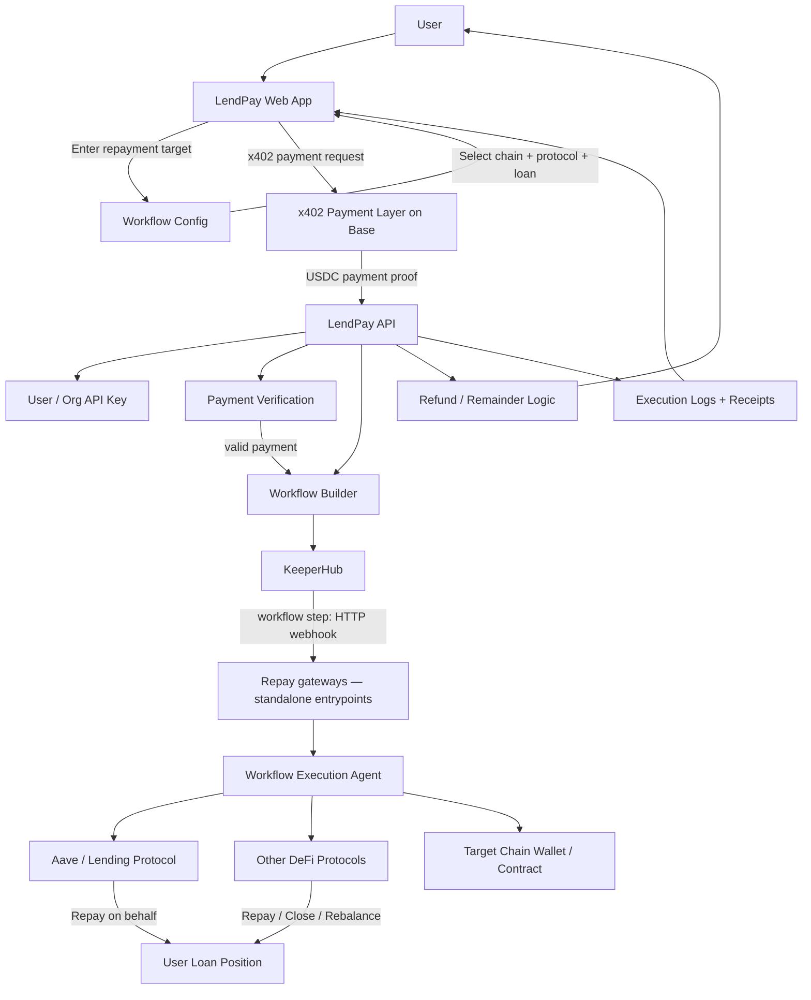

# ETHGlobal2026OpenAgent

This repository holds our **ETHGlobal 2026** build: the product, related code repos, a running [Todo](#todo) list, a work log (including deferred payment-path notes by day), target prizes, team, and use-of-AI notes. **Work window:** all submission work was done **from 2026-04-24** through **before the official submission deadline** — see [Hackathon log](#hackathon-log).

## Project idea

**LendPay** lets a user **repay DeFi loans with USDC** across supported networks **in one workflow**, instead of juggling bridges, dApps, and per-chain steps by hand. Execution and automation run through [KeeperHub](https://app.keeperhub.com) (workflows, wallet, and follow-up in the app).

*Status:* UI prototype in progress.

## Repos

- [lendpay-app](https://github.com/NautilusOSS/lendpay-app) — LendPay UI (prototype)
- [lendpay-backend](https://github.com/NautilusOSS/lendpay-backend) — LendPay backend (API / server for app and x402 flows)
- [openagent-demo1](https://github.com/NautilusOSS/openagent-demo1) — pay-to-workflow demo; **microtip**–style paid run (Base: RainbowKit, wagmi, viem; see that repo for setup and env). Its UI was used to **test** pay-to-workflow behavior **before** wiring the same flows into [lendpay-app](https://github.com/NautilusOSS/lendpay-app).
- [lendpay-gateway-algorand-dorkfi](https://github.com/NautilusOSS/lendpay-gateway-algorand-dorkfi) — LendPay **workflow gateway** (Algorand + DorkFi; routes payments into runs alongside [KeeperHub](https://app.keeperhub.com))

## Architecture

High-level flow: user and [lendpay-app](https://github.com/NautilusOSS/lendpay-app) → workflow config → x402 on Base → [lendpay-backend](https://github.com/NautilusOSS/lendpay-backend) → [KeeperHub](https://app.keeperhub.com) runs the workflow. **Repay gateways** (e.g. [lendpay-gateway-algorand-dorkfi](https://github.com/NautilusOSS/lendpay-gateway-algorand-dorkfi)) are **standalone processes**: they are **entry points** exposed as **HTTP URLs** that a **KeeperHub workflow step** calls as **webhooks**. The gateway handles chain- or stack-specific work; results and receipts still flow back through the API and UI.

## Todo

Active build tasks. Check `[x]` when done. Work deferred on the **LendPay workflow gateway** payment path (while **KeeperHub** still runs execution) is written under **2026-04-28** in the [Hackathon log](#hackathon-log), not as a separate README section.

- [ ] UI: Add Wallet Connection to the UI
- [ ] Demo: recorded walkthrough or link to a live deployment for judges
- [ ] Submission:Tighten submission materials (README, repo links, prize copy)
- [ ] Workflow gateway demo using KeeperHub

## Target prizes

- Top 10 finalist & partner prizes
- [KeeperHub](https://app.keeperhub.com) prizes
  - Best Use of KeeperHub
  - Builder Feedback Bounty

## Hackathon log

**Submission timing:** All work for this **ETHGlobal 2026** entry was completed **from 2026-04-24** (first log day, hackathon start) **through before the event’s official submission deadline** (per hackathon rules).

Running notes from the build: decisions, blockers, demos, and what changed when. Newest day on top. Keep entries short; link PRs, issues, or doc sections when they exist.

### 2026-05-02 — Submission

### 2026-05-01 — UI integration, demo, and submission

- Demonstrate payer identity for the workflow execution
  - [repayment of USDC loan from Base on Algorand using KeeperHub](https://lora.algokit.io/mainnet/block/60765685/group/t10tFy3EApfJxLPg7LmecUlYH8sRsUIQeN43b6n8pUA%3D)
- **GitHub (2026-05-01):** other same-day commits on `main` (local `git log` window `2026-05-01` → `2026-05-02`; no new commits that day in local **openagent-demo1** or **lendpay-app** clones — check [lendpay-app](https://github.com/NautilusOSS/lendpay-app/commits/main) / [openagent-demo1](https://github.com/NautilusOSS/openagent-demo1/commits/main) on GitHub if needed):
  - **[ETHGlobal2026OpenAgent](https://github.com/temptemp3/ETHGlobal2026OpenAgent)** — **3 commits:** [`d372089`](https://github.com/temptemp3/ETHGlobal2026OpenAgent/commit/d372089) README gateway architecture + hackathon log reorder; [`2f26f53`](https://github.com/temptemp3/ETHGlobal2026OpenAgent/commit/2f26f53) fix TODO section; [`d0b1c69`](https://github.com/temptemp3/ETHGlobal2026OpenAgent/commit/d0b1c69) fix link
  - **[lendpay-backend](https://github.com/NautilusOSS/lendpay-backend)** — [`795f2f4`](https://github.com/NautilusOSS/lendpay-backend/commit/795f2f4): `feat(workflows)` add **benefactorAddress** with **EVM or Algorand** validation
  - **[lendpay-gateway-algorand-dorkfi](https://github.com/NautilusOSS/lendpay-gateway-algorand-dorkfi)** — [`7325a31`](https://github.com/NautilusOSS/lendpay-gateway-algorand-dorkfi/commit/7325a31): repay **atomic group** (ulujs + arccjs), NT200 deposit, ARC200 approve, repay-on-behalf; group resource sharing, optional balance-box / retries, mainnet beacon

### 2026-04-30 — Payment path and workflow gateway

- **GitHub (2026-04-30):** commit activity on each remote’s default branch (`main`); links point at **github.com** (single commits or history).
  - **[ETHGlobal2026OpenAgent](https://github.com/temptemp3/ETHGlobal2026OpenAgent)** — [`52a3aa6`](https://github.com/temptemp3/ETHGlobal2026OpenAgent/commit/52a3aa6): README gateway-demo [Todo](#todo) item; hackathon log day bump
  - **[lendpay-backend](https://github.com/NautilusOSS/lendpay-backend)** — [`5ddee4a`](https://github.com/NautilusOSS/lendpay-backend/commit/5ddee4a): `feat(gateway)` integrate **KeeperHub simple-workflow** with **settlement payload**
  - **[openagent-demo1](https://github.com/NautilusOSS/openagent-demo1)** — [`1a6357b`](https://github.com/NautilusOSS/openagent-demo1/commit/1a6357b), [`ebeba9e`](https://github.com/NautilusOSS/openagent-demo1/commit/ebeba9e): **KeeperHub workflows**, **x402 gateway** panel, **LendPay presets**; execute panel sends **`benefactorAddress`** for gateway calls
  - **[lendpay-gateway-algorand-dorkfi](https://github.com/NautilusOSS/lendpay-gateway-algorand-dorkfi)** — **8 commits** that day on GitHub ([`main` commit history](https://github.com/NautilusOSS/lendpay-gateway-algorand-dorkfi/commits/main)): **DorkFi repay gateway** (Base receipt → Algorand repay); optional **webhook API keys** + key docs; **repay flow** / **systemd** guides; Algorand **`.env.example`** (Nodely); **`PAYMENT_MAX_AGE_SECONDS=0`** = no age limit
  - **[lendpay-app](https://github.com/NautilusOSS/lendpay-app)** — LendPay web UI **created in [Lovable](https://lovable.dev)** (Vite + React + TypeScript; ongoing work on [`main`](https://github.com/NautilusOSS/lendpay-app/commits/main))

### 2026-04-28 — Backend, architecture, and payment path

- Linked **[lendpay-backend](https://github.com/NautilusOSS/lendpay-backend)** in [Repos](#repos) (API / x402 server alongside [lendpay-app](https://github.com/NautilusOSS/lendpay-app))
- Added [Architecture](#architecture) section with a **Mermaid** flowchart (web app → workflow config → x402 on Base → LendPay API → KeeperHub → execution → refunds / logs)
- **[Todo](#todo):** **Browser x402** with [Base proof](https://basescan.org/tx/0x31de8c5ff8d66494805c11b7b0fcfde508d91aaf4a89cf06d755dbb8fa5ba946) **done**; payer identity, wallet, demo, and submission materials **completed** by submission (see [2026-05-01](#2026-05-01--ui-integration-demo-and-submission))
- **Deferred payment-path backlog** (recorded here instead of a separate README section): the exact **payment path** waits on the **LendPay workflow gateway**; **KeeperHub** still runs **workflow execution**. Until the gateway is clear, we are not tracking these in active Todo:
  - **End-to-end repay** through [KeeperHub](https://app.keeperhub.com) (workflow + wallet) — after gateway routes payments into runs
  - **x402 + LendPay** — **[KeeperHub](https://app.keeperhub.com) workflow fee** + **loan-repay** from the app (single 402, staged 402s, or batched—TBD). *Blocked* on **KeeperHub** (not LendPay-only); also gated on gateway
  - **x402 + LendPay (packs)** — LendPay (pack UX, optional refund rules) and KeeperHub org (list packs, org wallet for refund txs); not blocked on dynamic-402 in the call route; also gated on gateway
  - **KeeperHub workflows / packs** — workflow to demo **0.10 USDC** pack with x402; workflows or tiers **1, 2, 5, 10, 20, 50, 100 USDC**

### 2026-04-27 — Kickoff UI (prototype) + Project Idea

- Finalize project idea: **LendPay** (see [Project idea](#project-idea))
- Build UI prototype for LendPay

### 2026-04-25 - 2026-04-26 — Project Ideas

- Consider project idea after exploratory research

### 2026-04-24 — Start

- Exploratory research on KeeperHub workflow execution for agents including:
  - Workflow creation
  - Paid workflow execution using the KeeperHub wallet
  - Dev environment setup

## Team

- [temptemp3](https://github.com/temptemp3) — Lead developer

## Use of AI

How AI helped on this project; we update this as the build evolves.

**Tools**

- [ChatGPT](https://chatgpt.com) — project naming brainstorm, early UI spec notes, logo and branding exploration, architecture documentation
- [Lovable](https://lovable.dev) — UI prototype; **logo** and **cover image** generation
- [Cursor](https://cursor.com) — coding assistance, workflow generation via KeeperHub MCP

**Verified by hand**

- Application logic, on-chain calls, product decisions
- Workflow changes and follow-up in [KeeperHub](https://app.keeperhub.com)

